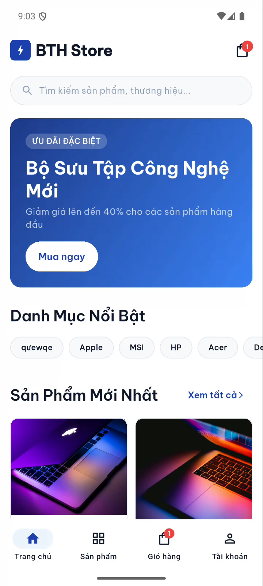
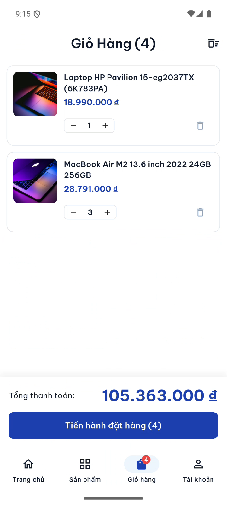
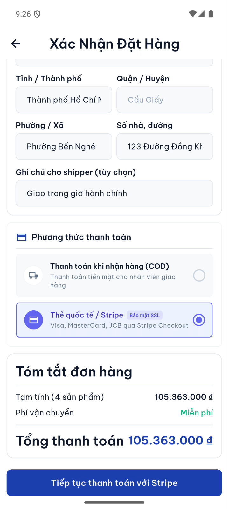
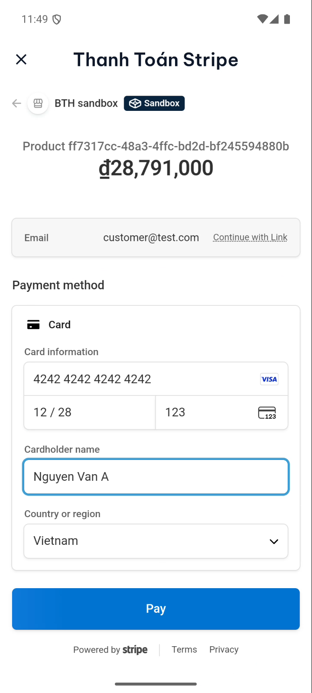
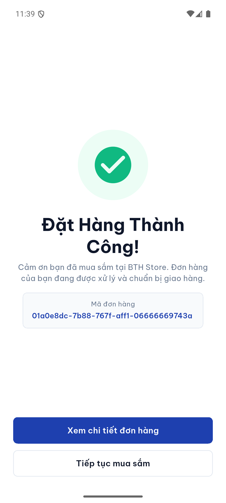
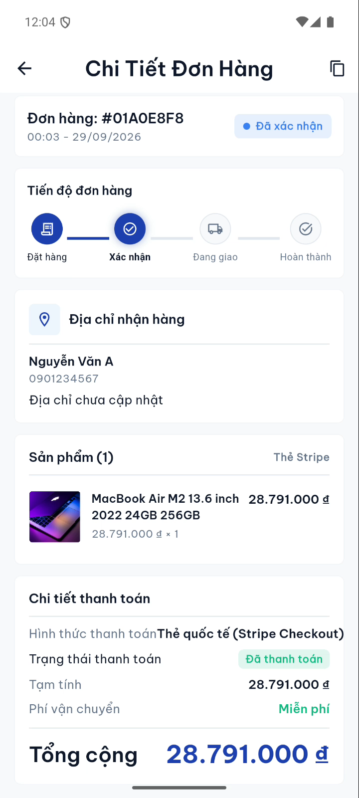
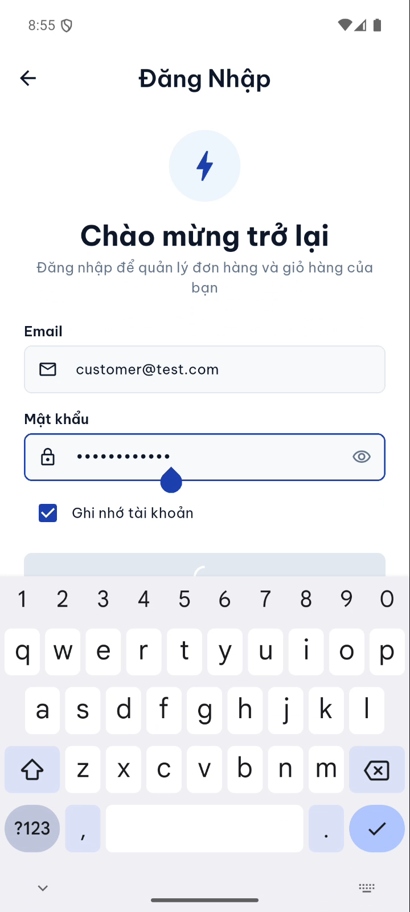
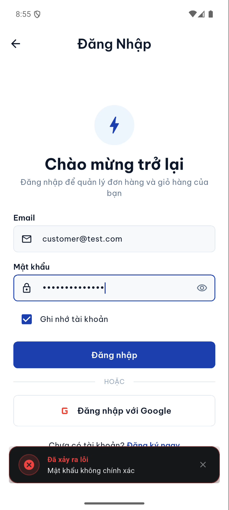

# 📱 BTH Ecommerce Mobile Application

[](https://flutter.dev)
[](https://dart.dev)
[](https://riverpod.dev)
[](https://pub.dev/packages/go_router)
[](https://www.keycloak.org)
[](https://stripe.com)

Ứng dụng mua sắm thương mại điện tử công nghệ cao cấp trên nền tảng di động (iOS / Android), kết nối trực tiếp với hệ sinh thái **Microservices Backend**, xác thực bảo mật chuẩn Enterprise qua **Keycloak OAuth2/OIDC**, thanh toán trực tuyến quốc tế qua **Stripe Checkout WebView**, và hệ thống giao diện **Glowing Obsidian UI & Toast** hiện đại.

---

## 🎬 Video Demo Các Luồng Hoạt Động (Demo Flows)

Toàn bộ các video ghi hình thực tế từng luồng chức năng trên thiết bị Android Emulator được lưu trữ trực tiếp trong thư mục [`demo/`](demo/):

| STT | Luồng chức năng (Flow) | Video Demo | Thời lượng & Dung lượng | Điểm nổi bật |
| :---: | :--- | :---: | :---: | :--- |
| **01** | **Xác thực & Quản lý Tài khoản** | [🎥 Xem Video](demo/01_auth_profile_flow.mp4) | `00:54` (2.58 MB) | Bắt lỗi đăng nhập sai (Glowing Crimson Error Toast), đăng nhập chuẩn Keycloak, xem trang Profile, mở Sổ địa chỉ, Trung tâm hỗ trợ (Glowing Info Toast). |
| **02** | **Duyệt Danh mục & Chi tiết Sản phẩm** | [🎥 Xem Video](demo/02_product_browsing_detail_flow.mp4) | `01:21` (3.84 MB) | Hero Banner khuyến mãi, chip lọc thương hiệu (Apple, HP, MSI), tìm kiếm tức thì "MacBook", Skeleton loading, Carousel ảnh sản phẩm mượt mà, thông số kỹ thuật. |
| **03** | **Quản lý Giỏ hàng (Cart Management)** | [🎥 Xem Video](demo/03_cart_management_flow.mp4) | `00:20` (0.94 MB) | Thêm sản phẩm vào giỏ kèm Glowing Emerald Toast, tăng/giảm số lượng real-time, cập nhật tổng thanh toán tự động, xóa sản phẩm khỏi giỏ. |
| **04** | **Đặt hàng & Thanh toán Thẻ Stripe** | [🎥 Xem Video](demo/04_checkout_stripe_payment_flow.mp4) | `01:14` (3.36 MB) | Chọn địa chỉ từ sổ địa chỉ, chọn phương thức Stripe Checkout, nhập thẻ thanh toán quốc tế sandbox, xử lý giao dịch an toàn, chuyển hướng Đặt Hàng Thành Công & chi tiết đơn hàng "Đã thanh toán". |
| **05** | **Vòng đời Đơn hàng & Stepper Timeline** | [🎥 Xem Video](demo/05_order_lifecycle_complete_flow.mp4) | `02:16` (6.38 MB) | Danh sách đơn hàng theo tab (Chờ xử lý, Đang giao, Hoàn thành), Order Stepper 4 bước thời gian thực (Đặt hàng $\rightarrow$ Xác nhận $\rightarrow$ Đang giao $\rightarrow$ Hoàn thành), hủy đơn hàng an toàn. |

---

## 📸 Thư Viện Ảnh Giao Diện (Screenshots Gallery)

| Trang chủ & Danh mục | Chi tiết sản phẩm | Giỏ hàng & Toast Emerald |
| :---: | :---: | :---: |
|  |  |  |

| Xác nhận đặt hàng | Thanh toán Stripe Sandbox | Đặt hàng thành công |
| :---: | :---: | :---: |
|  |  |  |

| Chi tiết đơn hàng & Stepper | Quản lý tài khoản | Thông báo lỗi Glowing Obsidian |
| :---: | :---: | :---: |
|  |  |  |

---

## ✨ Điểm Nhấn Thiết Kế & Tính Năng Nổi Bật

### 1. 🌌 Hệ thống Glowing Obsidian Toast (`AppToast`)
- Thiết kế frosted glassmorphism cao cấp: nền đen bán trong suốt `Color(0xE612151C)`, bo góc 14px, viền kim cương tinh xảo.
- Hiệu ứng ánh sáng hào quang (Glow Accents) tùy biến theo ngữ cảnh:
  - **Success**: Vòng sáng Emerald Neon (`0xFF059669`) biểu tượng checkmark mạ viền sáng.
  - **Error**: Vòng sáng Crimson Carmine (`0xFFDC2626`) biểu tượng cảnh báo rung nhẹ.
  - **Info**: Vòng sáng Sapphire Blue (`0xFF2563EB`) biểu tượng trợ giúp thanh lịch.
- Hỗ trợ swipe-to-dismiss và tự động ẩn mượt mà với hoạt ảnh Fade + Slide.

### 2. 💳 Tích hợp Thanh toán Quốc tế Stripe Checkout
- Hỗ trợ WebView bảo mật chuẩn PCI-DSS ngay bên trong ứng dụng di động.
- Tự động đồng bộ trạng thái đơn hàng (Webhooks & Rest APIs): `PENDING` $\rightarrow$ `PAID` $\rightarrow$ `CONFIRMED`.
- Trải nghiệm Link 1-click hoặc điền thẻ tín dụng (Visa, MasterCard, JCB, Amex) với định dạng số thẻ chống giật lag.

### 3. 📦 Order Lifecycle Stepper Trực quan
- Thanh tiến độ 4 giai đoạn chuẩn thương mại điện tử hiện đại:
  1. **Đặt hàng**: Ghi nhận đơn hàng vào hệ thống microservices.
  2. **Xác nhận**: Đã xác nhận đơn hàng và thanh toán thành công.
  3. **Đang giao**: Đơn vị vận chuyển tiếp nhận kiện hàng.
  4. **Hoàn thành**: Giao hàng thành công đến tay khách hàng.
- Huy hiệu trạng thái thanh toán và đơn hàng với màu sắc semantic rõ ràng.

### 4. 🔐 Bảo Mật Đăng Nhập Doanh Nghiệp (Keycloak OAuth2/OIDC)
- Tự động refresh JWT access token ngầm thông qua `Dio Interceptors`.
- Lưu trữ token an toàn trên thiết bị bằng `flutter_secure_storage`.
- Đồng bộ thông tin cá nhân và sổ địa chỉ giao hàng nhiều địa điểm.

---

## 🏗️ Kiến Trúc Dự Án (Clean Architecture)

Dự án áp dụng mô hình Clean Architecture kết hợp Feature-first folder structure:

```
lib/
├── core/                       # Thành phần cốt lõi dùng chung toàn ứng dụng
│   ├── constants/              # Hằng số API, Assets, Theme tokens
│   ├── network/                # Cấu hình Dio Client, Interceptors, Token Refresh
│   ├── storage/                # Secure Storage lưu trữ phiên đăng nhập
│   └── theme/                  # Định nghĩa Color Palette, Typography (Inter font)
├── features/                   # Các module chức năng theo nghiệp vụ
│   ├── auth/                   # Đăng nhập Keycloak, Quản lý Token, Profile
│   ├── product/                # Danh mục sản phẩm, Tìm kiếm, Chi tiết, Carousel
│   ├── cart/                   # Quản lý giỏ hàng, Tính giá trị đơn hàng
│   ├── checkout/               # Địa chỉ nhận hàng, Stripe Payment WebView
│   └── order/                  # Danh sách đơn hàng, Chi tiết đơn hàng, Stepper
├── routing/                    # Điều hướng GoRouter & App Coordinator
└── shared/                     # Widgets dùng chung & Glowing Toast Dialogs
    ├── dialogs/
    │   └── app_toast.dart      # Glowing Obsidian Toast Component
    └── widgets/
        ├── app_button.dart
        ├── app_text_field.dart
        └── skeleton_loader.dart
```

---

## 🚀 Hướng Dẫn Cài Đặt & Chạy Ứng Dụng

### Yêu cầu tiên quyết
- **Flutter SDK**: `>= 3.19.0`
- **Dart SDK**: `>= 3.3.0`
- **Android Studio** & Android SDK (API 34+) hoặc Xcode (cho iOS)
- Các dịch vụ Backend Microservices đang chạy:
  - API Gateway: `http://localhost:8080` (hoặc `10.0.2.2:8080` trên Android Emulator)
  - Keycloak Server: `http://localhost:8080/auth` (Realm: `ecommerce`)
  - Stripe Sandbox Keys đã được cấu hình trong backend

### Các bước khởi chạy

1. **Clone repository:**
   ```bash
   git clone git@github.com:BTH-IT/mobile-microservice-ecommerce.git
   cd mobile-microservice-ecommerce
   ```

2. **Cài đặt dependencies:**
   ```bash
   flutter pub get
   ```

3. **Cấu hình môi trường (nếu cần đổi IP máy chủ):**
   Mặc định ứng dụng đã tự động map `10.0.2.2:8080` cho Android Emulator và `localhost:8080` cho iOS Simulator.

4. **Chạy ứng dụng ở chế độ Debug:**
   ```bash
   flutter run
   ```

5. **Build APK Release:**
   ```bash
   flutter build apk --release
   ```
   File APK thành phẩm nằm tại: `build/app/outputs/flutter-apk/app-release.apk`.

---

## 👨‍💻 Tác Giả & Bản Quyền

- **Tác giả:** BTH ([@BTH-IT](https://github.com/BTH-IT))
- **Email:** hungbienthanh@gmail.com
- **Dự án:** Microservices Ecommerce Ecosystem
